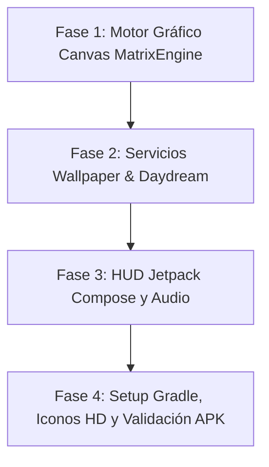

# Plan de Trabajo: Matrix Code Rain Android

## 📌 Dashboard de Estado
- **Proyecto:** Matrix Code Rain Android (Nativo + Live Wallpaper + Screensaver)
- **Hito Actual:** Hito 1.0 — MVP Nativo, Live Wallpaper & Build Estable ✅
- **Estado Global:** Totalmente funcional, APK Debug compilado con éxito (100% completado)
- **Fase Activa:** Fase 4: Setup Gradle, Iconos HD y Validación APK ✅
- **Bitácora Histórica:** [`BITACORA.md`](./BITACORA.md)

---

## 🛠️ Ficha Técnica y Mapa del Proyecto

| Componente | Tecnología / Ubicación | Rol Principal |
| :--- | :--- | :--- |
| **Motor Gráfico (Engine)** | Kotlin 2D Canvas en `engine/MatrixEngine.kt` | Renderizado ultra-optimizado a 60-120 FPS sin GC churn, cuadrícula estática, estelas y bloom neón. |
| **Live Wallpaper** | Android `WallpaperService` en `service/MatrixWallpaperService.kt` | Fondo de pantalla animado para Home y Lockscreen con bajo consumo energético al apagarse la pantalla. |
| **Salvapantallas (Daydream)** | Android `DreamService` en `service/MatrixDreamService.kt` | Modo salvapantallas interactivo al estar en base de carga o reposo. |
| **Interfaz HUD Flotante** | Jetpack Compose + Material 3 en `ui/` | Panel Glassmorphism Cyberpunk para calibrar columnas, densidad, velocidad, colores y mensajes. |
| **Motor de Audio** | Android `MediaPlayer` en `audio/RainAudioManager.kt` | Bucle continuo de lluvia binaural con fundidos suaves (*fade-in* y *fade-out*). |
| **Persistencia** | Jetpack DataStore Preferences en `data/MatrixPreferences.kt` | Almacenamiento reactivo de parámetros compartido entre Activity y WallpaperService. |
| **Iconografía** | Mipmaps PNG + Adaptive Vector + `google-play-icon.png` | Iconos HD adaptativos y recurso 512x512 para Google Play Store. |

### Comandos de Ejecución y Validación
- **Compilación APK Debug:** `.\gradlew assembleDebug`
- **Instalación en Dispositivo/Emulador:** `.\gradlew installDebug`
- **Inspección de Dispositivos Conectados:** `& "C:\Users\ferna\AppData\Local\Android\Sdk\platform-tools\adb.exe" devices`
- **Ubicación del APK Generado:** `app\build\outputs\apk\debug\app-debug.apk`

---

## 🗺️ Roadmap y Estado de las Fases



### Resumen de Fases Completadas (Ver detalle en BITACORA.md)
- *Fase 1: Motor Gráfico Canvas MatrixEngine:* Render 2D en `MatrixEngine.kt` con glifos auténticos, modo cuadrícula fija y desplazamiento dinámico. ✅
- *Fase 2: Servicios Wallpaper & Daydream:* Implementación de `MatrixWallpaperService` y `MatrixDreamService` registrados en el AndroidManifest. ✅
- *Fase 3: HUD Jetpack Compose y Audio:* Interfaz `CyberHudOverlay`, 6 paletas cyberpunk, inyector de mensajes y sonido binaural `RainAudioManager`. ✅
- *Fase 4: Setup Gradle, Iconos HD y Validación APK:* Configuración de `gradle.properties`, corrección de tipos en `SlidersSection.kt`, generación de mipmaps y compilación exitosa del APK. ✅

---

## 🎯 Fase Activa: Fase 4: Setup Gradle, Iconos HD y Validación APK ✅

### Objetivo
Asegurar la compilación limpia del proyecto nativo Android, configurar el entorno Gradle/SDK, generar los recursos de iconografía para todas las densidades de pantalla y verificar el binario APK.

### Criterios de Aceptación
- Build exitoso con `./gradlew assembleDebug` sin errores de compilación ni dependencias faltantes.
- Configuración de AndroidX habilitada en `gradle.properties`.
- Iconografía completa en `mipmap-mdpi`, `hdpi`, `xhdpi`, `xxhdpi`, `xxxhdpi` y `google-play-icon.png` (512x512).
- APK generado y verificado en `app/build/outputs/apk/debug/app-debug.apk`.

---

## 🚀 Cómo Continuar en la Siguiente Conversación

Al abrir una nueva conversación, copia y pega el siguiente mensaje:

```
Continúa con el PLAN_DE_TRABAJO.md de e:/Antigravity/Matrix code rain Android.
El Hito 1.0 (MVP Nativo, Live Wallpaper y Build Estable) está completado.
Procede de forma 100% autónoma para la siguiente solicitud o despliegue.
```
