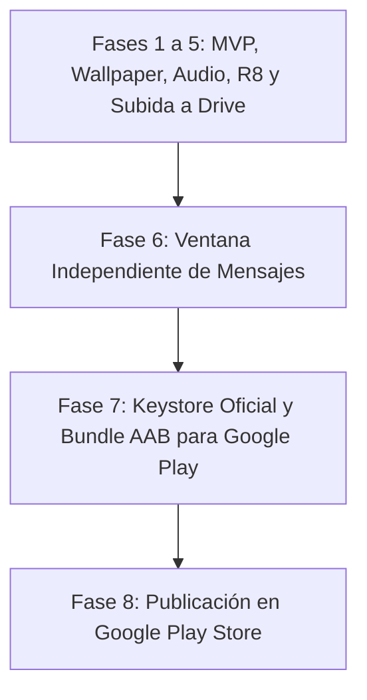

# Plan de Trabajo: Matrix Code Rain Android

## 📌 Dashboard de Estado
- **Proyecto:** Matrix Code Rain Android (Nativo + Live Wallpaper + Screensaver)
- **Hito Actual:** Hito 1.0 — MVP Nativo, Live Wallpaper & Build Estable ✅
- **Estado Global:** App 100% funcional, v1.0.0 en GitHub, lista para publicar en Google Play (85% hacia publicación en tienda)
- **Fase Activa:** **Fase 7: Preparación para Google Play Console (Keystore Oficial y Formato AAB)** ⬜
- **Bitácora Histórica:** [`BITACORA.md`](./BITACORA.md)

---

## 🛠️ Ficha Técnica y Mapa del Proyecto

| Componente | Tecnología / Ubicación | Rol Principal |
| :--- | :--- | :--- |
| **Motor Gráfico (Engine)** | Kotlin 2D Canvas en `engine/MatrixEngine.kt` | Renderizado ultra-optimizado a 60-120 FPS sin GC churn, cuadrícula estática, estelas y bloom neón. |
| **Live Wallpaper** | Android `WallpaperService` en `service/MatrixWallpaperService.kt` | Fondo de pantalla animado para Home y Lockscreen con bajo consumo energético al apagarse la pantalla. |
| **Salvapantallas (Daydream)** | Android `DreamService` en `service/MatrixDreamService.kt` | Modo salvapantallas interactivo al estar en base de carga o reposo. |
| **Interfaz HUD Flotante** | Jetpack Compose + Material 3 en `ui/` | Panel Glassmorphism Cyberpunk para calibrar columnas, densidad, velocidad, colores y audio. |
| **Ventana de Mensajes** | `MessageHudOverlay.kt` en `ui/components/` | Ventana independiente con botón en esquina inferior izquierda y función de borrado de texto. |
| **Motor de Audio** | Android `MediaPlayer` en `audio/RainAudioManager.kt` | Bucle continuo de lluvia binaural con fundidos suaves (*fade-in* y *fade-out*). |
| **Persistencia** | Jetpack DataStore Preferences en `data/MatrixPreferences.kt` | Almacenamiento reactivo de parámetros compartido entre Activity y WallpaperService. |
| **Repositorio GitHub** | Git + GitHub (`Duke33-Devops/matrix-code-rain-android`) | Repositorio remoto sincronizado con tag `1.0.0`. |
| **Distribución Google Drive** | Google Drive for Desktop (`H:\Mi unidad`) | Sincronización en la nube de binarios APK Debug y Release firmados. |

### Comandos de Ejecución y Validación
- **Compilación APK Debug:** `.\gradlew assembleDebug`
- **Compilación APK Release Firmado:** `.\gradlew assembleRelease`
- **Compilación Android App Bundle (Google Play):** `.\gradlew bundleRelease`
- **Ubicación de Binarios en Google Drive:** `H:\Mi unidad\matrix-code-rain-release.apk` y `matrix-code-rain-debug.apk`

---

## 🗺️ Roadmap y Estado de las Fases



### Resumen de Fases Completadas (Ver detalle en BITACORA.md)
- *Fases 1 a 5:* Motor Canvas 2D, WallpaperService, Daydream, HUD Compose, R8/Proguard y subida a Google Drive. ✅
- *Fase 6: Ventana Independiente de Mensajes:* Creación de `MessageHudOverlay`, redondel en esquina inferior izquierda, elevación del texto en pantalla, botón para quitar el mensaje activo y subida de v1.0.0 a GitHub. ✅

---

## 🎯 Fase Activa: Fase 7: Preparación para Google Play Console (Keystore Oficial y Formato AAB) ⬜

### Objetivo
Generar el almacén de claves de producción oficial (`release-upload.jks`), configurar la firma de subida en Gradle y compilar el paquete Android App Bundle (`.aab`) que exige Google Play Console para admitir la aplicación en la tienda.

### Tareas Pendientes
1. Generar el archivo de claves de subida de producción (`release-upload.jks`) con `keytool` de Java JDK.
2. Configurar `app/build.gradle.kts` para que utilice el keystore de producción en la tarea de firma `release`.
3. Ejecutar `./gradlew bundleRelease` para generar el artefacto optimizado `app-release.aab`.
4. Copiar y sincronizar `matrix-code-rain-release.aab` en la raíz de Google Drive (`H:\Mi unidad`).
5. Guardar una copia segura de `release-upload.jks` en Google Drive para garantizar que nunca se pierda la clave de actualización.

### Criterios de Aceptación
- Archivo `.aab` generado correctamente y validado con peso optimizado.
- Archivo disponible en `H:\Mi unidad\matrix-code-rain-release.aab` listo para subir a Google Developer Console.
- Almacén de claves respaldado y documentado.

---

## 🚀 Cómo Continuar en la Siguiente Conversación

Al abrir una nueva conversación, copia y pega el siguiente mensaje:

```
Continúa con el PLAN_DE_TRABAJO.md de e:/Antigravity/Matrix code rain Android.
Estamos en la Fase 7: Preparación para Google Play Console (Keystore Oficial y Formato AAB).
Procede de forma 100% autónoma para generar la clave de subida, compilar el bundle .aab y sincronizarlo en Google Drive.
```
